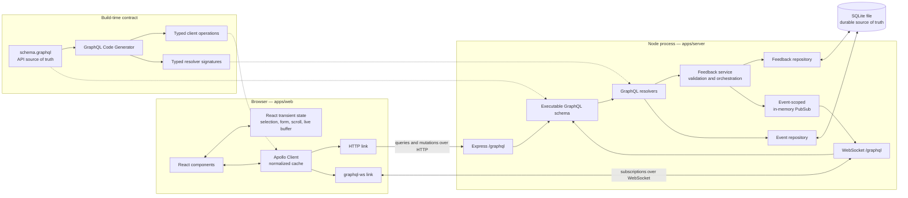
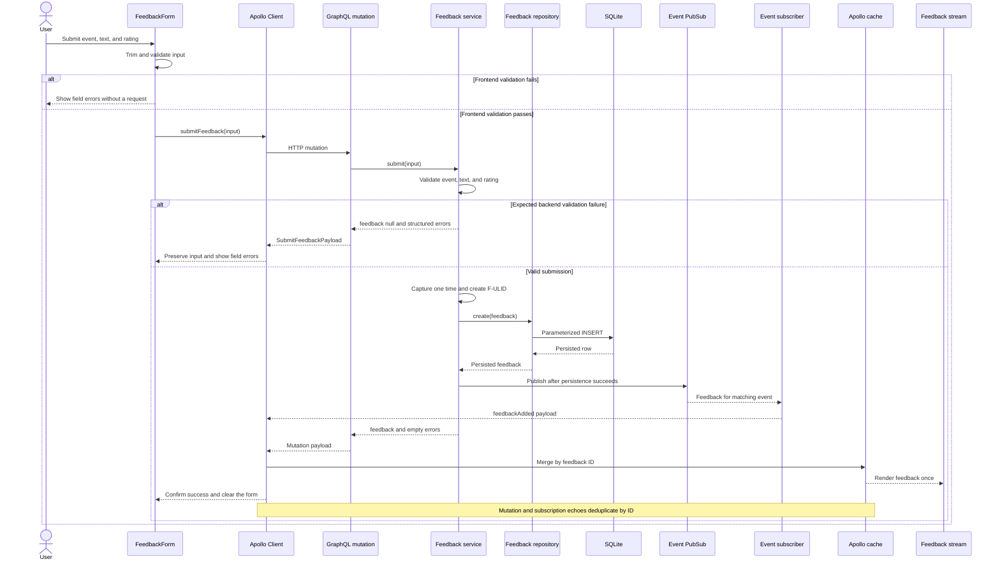
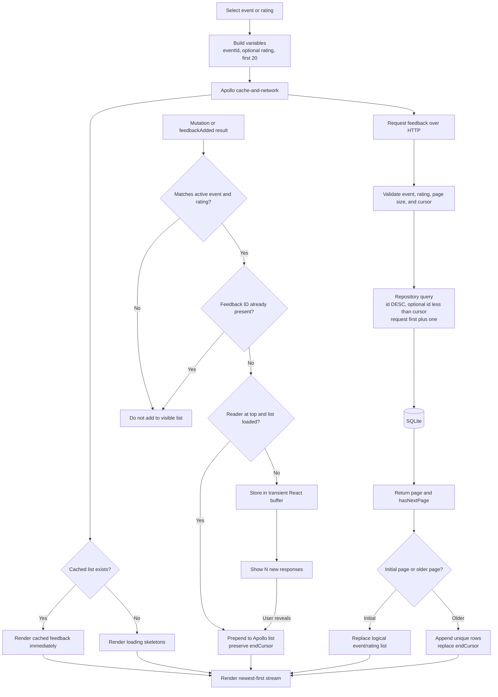

# Event Feedback Hub — Design

## Purpose

Event Feedback Hub is a local TypeScript web application for collecting and viewing anonymous event feedback. A user can select a predefined event, submit written feedback with a rating from 1 through 5, filter and paginate the event's feedback, and receive new submissions in real time.

This document records the intended architecture, the reasoning behind it, and the known limits of the take-home implementation.

## Scope and assumptions

- The frontend uses React and TypeScript.
- The backend exposes a GraphQL API from Node.js and TypeScript.
- The application runs locally; deployment and cloud infrastructure are outside scope.
- One Node process serves the take-home application.
- Users are anonymous; there are no accounts, authentication, profiles, or user records.
- Events are predefined, seeded, and read-only.
- The event selector searches the already-fetched predefined catalog locally.
- Feedback is append-only; editing and deletion are outside scope.
- Feedback displays its server-recorded submission time.

Anonymous submissions mean the application cannot enforce one response per human. Duplicate submissions are possible and accepted for this scope.

## Technology choices

### Runtime and repository

- Node.js `24.20.0`, pinned in `.nvmrc`
- npm `11.19.0` with npm workspaces and a committed lockfile
- ECMAScript modules
- Strict TypeScript configuration
- Vite for the React application

The repository uses lightweight npm workspaces rather than Turborepo or Nx because there are only two applications and no need for a separate orchestration layer.

### API and real-time transport

- Express
- Apollo Server
- `graphql-ws` and `ws` for GraphQL subscriptions over WebSockets
- An in-memory event-scoped publish/subscribe service
- GraphQL Code Generator for client operations and server resolver signatures

GraphQL Yoga was considered because it offers a compact subscription setup, including Server-Sent Events. Apollo Server plus an explicit WebSocket integration was selected to keep the client and server operation model familiar and make the persistent subscription transport visible.

### Persistence

- SQLite in a local file
- `better-sqlite3`
- Direct parameterized SQL behind repository interfaces

SQLite keeps the assessment self-contained while still providing relational constraints, foreign keys, indexes, transactions, and durable local data. The generated database is runtime state and is not committed; readable `schema.sql` and `seed.sql` files reproduce it.

Direct SQL keeps the small query surface and cursor behavior visible. Kysely and Drizzle were considered but would add another schema representation for two tables. Prisma was considered too abstract and setup-heavy for the current scope. GraphQL resolvers never contain SQL; repositories own persistence.

### Client data management

- Apollo Client
- Apollo normalized in-memory cache
- React state only for transient interface behavior

Apollo Client directly supports the chosen queries, mutations, pagination, cache normalization, and subscriptions. Alternatives considered were urql, Relay, TanStack Query with `graphql-request`, and raw HTTP/WebSocket clients. Each would either introduce an unfamiliar cache model, impose unused Relay conventions, or require more manual subscription and merge coordination.

### Quality tooling

- ESLint flat configuration with type-aware `typescript-eslint` rules
- React Hooks and React Refresh lint rules
- Prettier for formatting
- `.editorconfig` for basic editor consistency
- Vitest, React Testing Library, Supertest, and Apollo Server integration tests
- GitHub Actions running the same `npm run verify` gate used locally
- npm install scripts denied by default, with only the required `esbuild` and `better-sqlite3` native setup explicitly approved

ESLint owns correctness-oriented static analysis and Prettier owns formatting. The repository intentionally avoids Husky and `lint-staged`; explicit root commands and CI provide the quality gate without installing hooks on a reviewer's machine.

Accessibility is verified through semantic markup and React Testing Library assertions against the rendered interface. The JSX accessibility lint plugin available when the toolchain was selected did not support ESLint 10, so it was omitted rather than forcing an incompatible peer dependency.

npm's install-script allowlist approves `esbuild`, whose platform binary is required by Vite, and `better-sqlite3`, whose native binding is required for SQLite access. The optional macOS `fsevents` script is explicitly denied; Vite can use its cross-platform file-watching fallback. This reduces unnecessary package-install execution while preserving reproducible frontend and database builds.

Apollo's transitive `@apollo/protobufjs` postinstall is also explicitly denied. Its script only creates an optional CLI dependency directory and prints version-scheme guidance; the application does not use its Protocol Buffer CLI, so running the script is unnecessary for GraphQL server behavior.

## Repository boundaries

```text
event-feedback-hub/
├── apps/
│   ├── web/
│   └── server/
├── docs/
│   └── design.md
├── AGENTS.md
├── codegen.yml
├── package.json
├── tsconfig.base.json
└── README.md
```

- `apps/web` owns React, Apollo Client, GraphQL operations, frontend validation, and transient UI state.
- `apps/server` owns GraphQL, WebSockets, backend validation, publish/subscribe, repositories, database setup, and SQLite access.
- The GraphQL schema is the API source of truth.
- Generated operation and resolver types replace manually duplicated shared API interfaces.

The server uses a feature-oriented hybrid structure:

```text
apps/server/
├── sql/
│   ├── schema.sql
│   └── seed.sql
└── src/
    ├── app.ts
    ├── index.ts
    ├── database/
    ├── features/
    │   ├── identifiers.ts
    │   ├── events/
    │   └── feedback/
    └── graphql/
```

Event and feedback models, persistence, services, pagination, and real-time behavior stay with the feature they implement. Their shared prefixed-ULID rules live once at the feature boundary in `identifiers.ts`. Shared SQLite connection and initialization code remains in `database`, while schema assembly and transport adapters remain in `graphql`. Static SQL lives in `sql` so it is not confused with executable TypeScript database code. This keeps related behavior together without introducing the additional ports, adapters, or schema-merging layers that a larger application might require.

`npm run codegen` reads the local SDL and regenerates committed server resolver signatures without requiring a running API. Verification runs code generation before static checks. Generated files are formatted automatically and excluded from ESLint because they are tool-owned output rather than handwritten source.

## System flow diagrams

### Runtime architecture and type flow

The browser uses two transports against one GraphQL schema. HTTP carries queries and mutations, while the WebSocket carries the event-scoped subscription. SQLite is the durable source of truth; the in-memory publisher only distributes records that have already been persisted.



### Submission and real-time delivery

The mutation response and the subscription can deliver the same feedback to the submitting browser. Both client paths therefore converge on the same ID-based merge behavior.



### Reading, pagination, and live cache updates

The query cursor always describes the oldest loaded database row. Appending older pages replaces that cursor; prepending or buffering newer live rows does not move it.



## Reproducible database setup

The repository commits:

- `apps/server/sql/schema.sql`;
- `apps/server/sql/seed.sql`; and
- a setup command that creates and seeds a local database.

It does not commit SQLite database or sidecar files.

Running `npm run setup` removes the previous local database and its sidecar files, then recreates and seeds the database in one transaction. The reset behavior is explicit because the command is intended for reproducible local setup, not production migration.

The demonstration data contains:

- `Document Intelligence Workshop`;
- `Insurance Automation Webinar`;
- `Insurtech Product Conference`; and
- 25 sample responses for the workshop, with five responses for each rating.

The 25 workshop responses make the default 20-item pagination boundary immediately reviewable. The other two events remain empty so the empty-state experience is also visible. Seed fixtures use fixed valid IDs for deterministic setup; runtime feedback IDs are generated by the server.

## Data model

Use type-prefixed ULIDs stored as `TEXT` primary keys:

- `E-{ULID}` for events
- `F-{ULID}` for feedback

Runtime IDs are generated by a monotonic ULID factory in the Node process. The prefixes aid logs and debugging, and ULID lexical order provides the stable newest-to-oldest feedback order and pagination key. ULIDs reveal approximate generation time; that is acceptable for anonymous event feedback but would need reconsideration where timing itself is sensitive.

```sql
CREATE TABLE events (
  id TEXT PRIMARY KEY
    CHECK (length(id) = 28 AND substr(id, 1, 2) = 'E-'),
  name TEXT NOT NULL UNIQUE
);

CREATE TABLE feedback (
  id TEXT PRIMARY KEY
    CHECK (length(id) = 28 AND substr(id, 1, 2) = 'F-'),
  event_id TEXT NOT NULL REFERENCES events(id),
  text TEXT NOT NULL
    CHECK (length(trim(text)) BETWEEN 1 AND 1000),
  rating INTEGER NOT NULL
    CHECK (rating BETWEEN 1 AND 5),
  created_at TEXT NOT NULL
    CHECK (
      strftime('%Y-%m-%dT%H:%M:%fZ', created_at) IS NOT NULL
      AND strftime('%Y-%m-%dT%H:%M:%fZ', created_at) = created_at
    )
);

CREATE INDEX feedback_event_id_idx
ON feedback(event_id, id DESC);

CREATE INDEX feedback_event_rating_id_idx
ON feedback(event_id, rating, id DESC);
```

Every connection enables `PRAGMA foreign_keys = ON`.

`created_at` stores the server-recorded submission time as canonical ISO-8601 UTC text with millisecond precision, for example `2025-01-01T00:00:10.000Z`. It is presentation and debugging data, not an ordering or cursor key. The server captures one `Date.now()` value and uses it for both the feedback ULID and `created_at`, avoiding small discrepancies between the two values. The seed fixtures also keep their fixed IDs and timestamps aligned. There is deliberately no database default: every write path must supply the server-owned value explicitly.

Feedback remains ordered and paginated by `id DESC`. Keeping `created_at` out of the cursor means display concerns do not create a second ordering rule, while a future import or backfill can give identifier generation time and semantic creation time different meanings without changing the field contract.

## GraphQL contract

```graphql
type Event {
  id: ID!
  name: String!
}

type Feedback {
  id: ID!
  event: Event!
  text: String!
  rating: Int!
  createdAt: String!
}

type Query {
  events: [Event!]!
  feedback(
    eventId: ID!
    rating: Int
    first: Int = 20
    after: String
  ): FeedbackConnection!
}

type FeedbackConnection {
  items: [Feedback!]!
  pageInfo: PageInfo!
}

type PageInfo {
  endCursor: String
  hasNextPage: Boolean!
}
```

`first` accepts integers from 1 through 50 and defaults to 20. An out-of-range value produces a `BAD_USER_INPUT` GraphQL error rather than being silently clamped. `rating` is optional; omitting it returns all ratings for the event.

The simplified `items` connection supports the required forward-only **Load older feedback** interaction. It intentionally omits Relay edges, backward traversal, edge metadata, and `totalCount` because the current client does not use them.

`Feedback.createdAt` is the canonical ISO-8601 UTC value persisted in SQLite. A string keeps the wire contract explicit without introducing a custom scalar for one server-authored field; the frontend formats it for display.

### Submission errors

```graphql
input SubmitFeedbackInput {
  eventId: ID!
  text: String!
  rating: Int!
}

enum FeedbackErrorCode {
  INVALID_EVENT
  EMPTY_TEXT
  TEXT_TOO_LONG
  INVALID_RATING
}

type UserError {
  field: String
  code: FeedbackErrorCode!
  message: String!
}

type SubmitFeedbackPayload {
  feedback: Feedback
  errors: [UserError!]!
}

type Mutation {
  submitFeedback(input: SubmitFeedbackInput!): SubmitFeedbackPayload!
}
```

A successful mutation returns the persisted feedback and an empty errors array. Expected validation failures return `feedback: null` and one or more structured errors. Unexpected database or execution failures remain top-level GraphQL errors.

### Subscription

```graphql
type Subscription {
  feedbackAdded(eventId: ID!): Feedback!
}
```

The subscription is scoped by event. Rating filtering of incoming feedback happens in React so changing the rating filter does not recreate the WebSocket operation.

## Validation boundaries

Validation exists at three layers:

1. React provides immediate accessible feedback.
2. The backend authoritatively validates event identity, trimmed text length from 1 through 1,000, and integer ratings from 1 through 5.
3. SQLite foreign keys and checks protect persisted event relationships, text bounds, rating range, and timestamp format. GraphQL and the backend service enforce the rating's integer semantics before persistence.

Expected validation failures are not used to hide unexpected repository failures.

## Cursor pagination

Feedback is ordered by `id DESC`. The logical cursor contains only the last feedback ID in the returned page and remains opaque to the client.

The transport cursor is the canonical unpadded base64url encoding of that feedback ID. Decoding must reproduce the same canonical cursor and yield a valid `F-{ULID}`; padded, malformed, event-prefixed, and otherwise noncanonical values are rejected with `BAD_USER_INPUT`. Clients treat the encoded value as an uninterpreted token.

- Initial page: query the selected event in descending ID order.
- Next page: add `id < :afterId`.
- Rating filter: add `rating = :rating`.
- Request `first + 1` rows to calculate `hasNextPage` without a separate count query.
- Return the last included ID as `endCursor`, or `null` for an empty result.

If a client loads `A, B, C`, receives a newer live item `N`, and then requests after `C`, the next page still begins with `D`. New inserts do not move the cursor boundary as they would with offset pagination.

Relay-style connections are future scope if per-edge metadata, backward traversal, or Relay Client becomes necessary. Such a migration should introduce and deprecate fields rather than breaking existing `items` consumers.

## Real-time delivery

Queries and mutations use HTTP. Subscriptions use GraphQL over a persistent WebSocket. Both transports use `/graphql` and the same executable schema and application context. Apollo's shutdown lifecycle drains the shared HTTP server and disposes active WebSocket operations together.

```text
submitFeedback
  → validate
  → capture one server timestamp
  → generate F-{ULID} from that time
  → persist feedback and the same time as created_at through the repository
  → commit succeeds
  → publish to the event-scoped in-memory channel
  → return persisted feedback
```

Publication happens only after persistence succeeds. The submitting browser can see the same entity in the mutation result and its subscription, so every merge path deduplicates by feedback ID.

Real-time delivery uses an event-scoped in-memory publisher, which is a deliberate fit for the assessment's single Node.js process. SQLite remains the source of truth, and the `graphql-ws` client retries a dropped transport connection. A page refresh queries SQLite and restores the current persisted view. For a multi-replica production deployment, the natural evolution would be a shared broker such as Redis plus a newest-page refetch and ID-based merge after reconnection.

## Client state and cache behavior

- SQLite is the durable shared source of truth.
- Apollo owns fetched events, feedback entities, event/rating lists, and pagination metadata.
- React owns selected filters, unsaved form state, scroll position, and the temporary new-response buffer.

The complete feedback list is not copied into React state.

Apollo identifies entities by `__typename` plus `id`. Feedback field identity uses `eventId` and `rating`, but not `first` or `after`, because pagination arguments identify pages of one logical list.

- Events use `cache-first` because they are seeded and read-only.
- Feedback uses `cache-and-network` so cached results render immediately while SQLite is checked for changes made since that event/rating view was last loaded.
- Older pages append unique items and replace the oldest `endCursor`.
- Live items prepend or buffer while preserving that cursor.
- Mutation results are added only to matching visible lists and later subscription delivery is deduplicated.

The client does not create optimistic feedback because authoritative IDs are server-generated, validation may reject a submission, and local SQLite persistence should be fast.

## User experience

The responsive page keeps one stable feedback-workspace card visible before and after event selection. Its left column contains the searchable event combobox while the right column begins with a selection prompt and is replaced by the feedback form once an event is chosen. This avoids repositioning the selector or resizing the card during the primary transition. The columns stack inside that same shared card on narrow viewports, and the feedback stream is revealed beneath it without horizontal overflow. The visual theme uses centralized TrustLayer-inspired ink, blue, and mint CSS tokens rather than treating individual component colors as unrelated values.

Clicking or focusing the event combobox opens its options and allows immediate typing. Search remains client-side because the complete predefined event catalog is already fetched and contains only three records; adding a paginated server contract would not improve this assessment workflow.

The page also contains a rating filter and explicit **Load older feedback** control. Each feedback card renders `createdAt` as a human-readable relative time and retains the canonical UTC value in semantic time markup for accessibility and inspection. Relative labels are presentation derived and periodically refreshed from the immutable server value by the client; they do not alter cached data or trigger a database refetch.

- At the top of the stream, matching live feedback appears immediately.
- While reading older records, matching live feedback is buffered behind an **N new responses** banner.
- Returning the feedback viewport to the top automatically reveals that buffer; the banner remains available for an earlier manual reveal.
- Initial loading uses feedback skeletons when no cached data exists.
- Event loading and failures disable progress until events can be retried.
- Empty events invite the first response; empty filters explain how to clear the filter.
- Initial feedback failures present a Retry action.
- Failed pagination retains the existing list.
- Submission disables the relevant controls, preserves fields on failure, and clears them only after confirmed persistence.

## Testing strategy

- Unit tests cover ULID behavior, cursor parsing, validation, timestamp presentation, and Apollo merge rules.
- Repository tests use isolated real SQLite databases created from production schema and seed files, including canonical timestamp constraints and fixture alignment between ULIDs and `created_at`.
- GraphQL integration tests use the real schema, resolvers, repositories, validation, and Apollo Server `executeOperation`.
- Server transport tests exercise GraphQL over real HTTP and `graphql-ws` connections against an isolated in-memory SQLite database.
- React Testing Library verifies user-visible loading, searchable event selection, form behavior, filtering, pagination, manual and automatic buffered reveals, and retry behavior.

The complete two-browser journey is an explicit manual acceptance check: one browser submits feedback, the other receives it live, rating filters remain correct, and a refresh restores persisted SQLite data.

## Known limitations and production evolution

- Add identity and uniqueness policies if one response per attendee becomes a requirement.
- Add separate imported, occurred, or updated timestamps if the product later needs lifecycle semantics beyond server submission time.
- Replace SQLite when deployment, multiple writers, or higher concurrency becomes material.
- Replace in-memory publish/subscribe when multiple backend replicas are introduced.
- For a production deployment requiring seamless continuity across temporary disconnects, refetch the newest persisted page after reconnection and merge by ID.
- Consider Kysely or Drizzle if database scale makes stronger generated query typing worthwhile.
- Add event administration only if event lifecycle management enters product scope.
